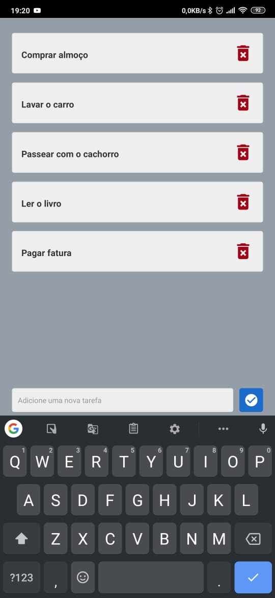

<h1 align="center">ToDoList
Aplicativo de lista de afazeres</h1>

## 💻  Apenas uma Tela.

 - Um aplicativo simples de lista;
;



<p align="center">
<!-- 
- This app was developed using React Naive + Expo.
 
 -->
</p>

## Voce pode baixar o APk pelo link:

https://drive.google.com/open?id=1LUneROwyDupnszscATtpTit1zs5FrFhD

## 🎩 Dependencias do desenvolvimento

 - npm para instalação ou 
```sh
npm install -g expo-cli
```
- yarn para instalação
```sh
yarn global add expo-cli
```
 - É necessario ter o  GIT instalado
```sh
git clone https://github.com/nathangabriel27/ToDoList.git
```

- Abra o projeto e execute para iniciar:
```sh
cd ToDoList
yarn
```

Obrigado!!